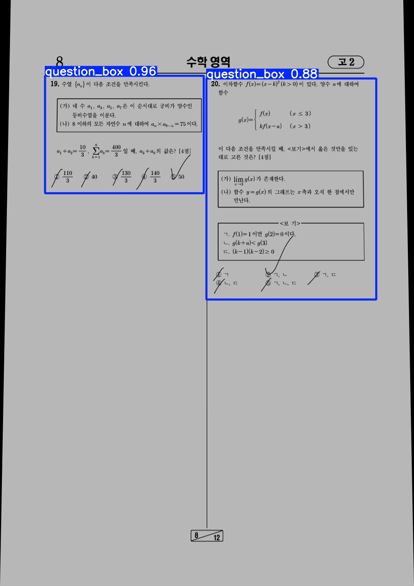
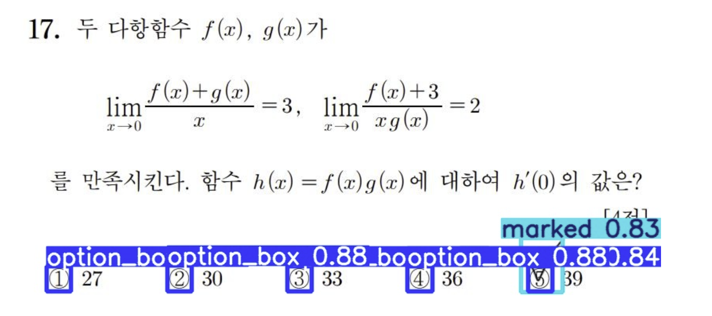

# Auto Grading System

## 프로젝트 설명
라즈베리파이 기반에서 객관식과 단답형으로 이루어진 시험지를 이미지 데이터로 변환 후 각 문제 영역을 구분하고, 문제에 기입된 답안을 정답과 비교하며 자동으로 채점이 이루어지는 시스템 

## 개발환경
-python

## 목차
1. 프로젝트 전체 흐름
2. 설치
3. 데이터 준비
4. ROI 추출
5. 객관식 학습
6. 단답형 학습
7. 테스트

## 1. 프로젝트 전체 흐름

## 2. 설치
터미널에서 yolov5 설치
<pre>git clone https://github.com/ultralytics/yolov5.git
cd yolov5  </pre>   

## 3. 데이터 준비
저희는 다양한 데이터 모집을 목적으로 모의고사, 공무원, 검정고시, 경찰지 시험지를 수집하였습니다. 처음은 학습 알고리즘 개발을 목적으로 카메라가 아닌 pdf로 진행을 하였으며 ROI추출, 객관식 채점, 단답형 채점을 별개로 진행을 먼저 하였습니다.

## 4. ROI 추출

## 5. 객관식 학습
yolo를 활용하여 2개의 class option_box와 marked_box로 구분하여 객관식 선택지와 선택된 답안을 학습시킨다.

## 6. 단답형 학습

## 7. 테스트

