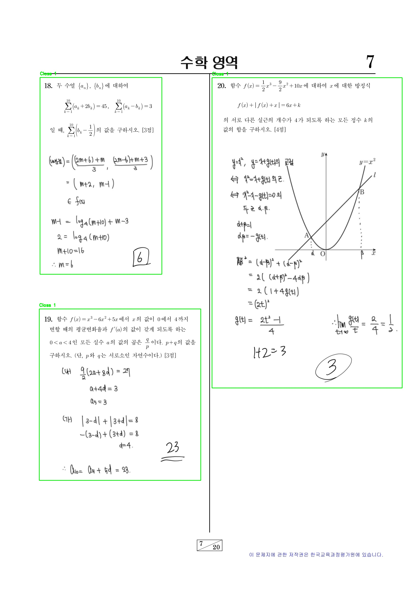
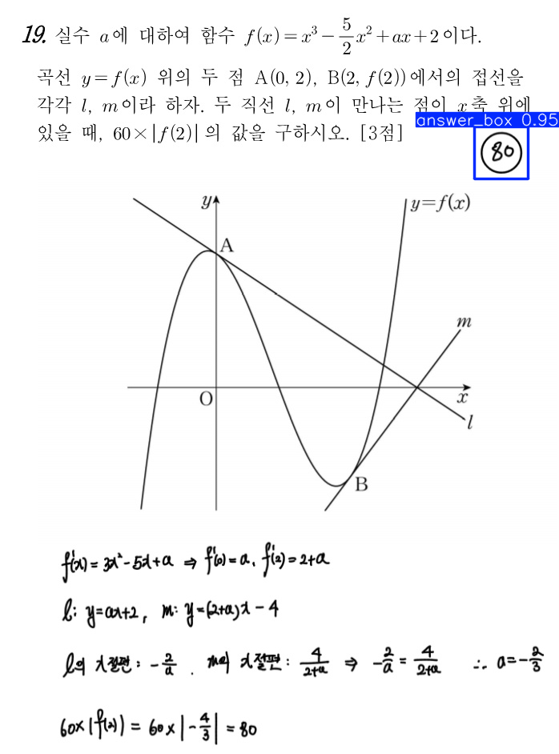
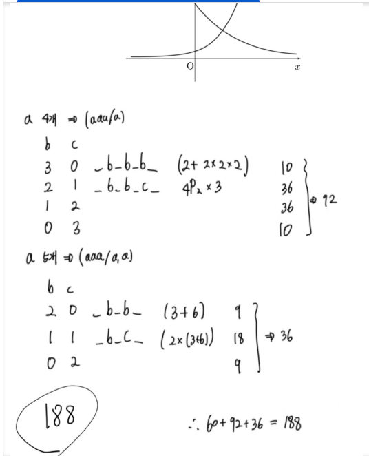
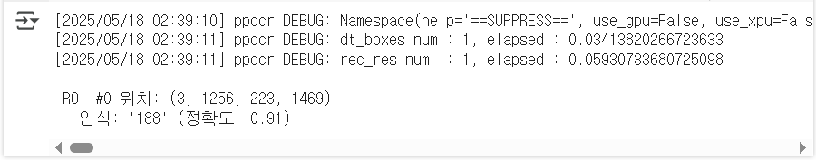

# Auto Grading System

## 프로젝트 설명
객관식과 단답형으로 이루어진 시험지를 이미지 데이터로 변환 후 각 문제 영역을 구분하여 ROI로 추출하고, 문제에 기입된 답안을 정답과 비교하며 자동으로 채점이 이루어지는 시스템. 라즈베리파이 환경에서 구현한다.

## 목차
1. 프로젝트 전체 흐름
2. 설치
3. 데이터 준비
4. ROI 추출
5. 객관식 채점
6. 단답형 채점
7. 표 정리
8. 테스트

## 1. 프로젝트 전체 흐름
프로젝트의 전체 흐름은 다음과 같다.

1. 시험지에서 객관식과 단답형 ROI 구분 추출
2. 객관식 자동 채점
    1. 문제 번호 인식
    2. 선택지 좌표 값 정렬을 통한 번호 매칭
    3. 마킹 좌표와 위치 비교를 통한 답안 인식
    4. 답안과 정답 비교
3. 단답형 자동 채점
    1. 문제 번호 인식
    2. 답안 ROI 추출
    3. OCR을 이용한 답안과 정답 비교
4. 채점 결과 정리

## 2. 설치
git에서 yolov5 download
<pre>git clone https://github.com/ultralytics/yolov5.git
cd yolov5  </pre>   

## 3. 데이터 준비
다양한 데이터 모집을 위해 모의고사, 수능, 공무원, 검정고시, 경찰지 시험지를 수집하였다. 학습 알고리즘 개발을 목적으로 실제 시험지 사진이 아닌 pdf로 진행 중이다. 객관식 문항은 다양한 형태의 마킹 형태를 삽입하였으며, 단답형 문항은 풀이 과정과 답안 영역을 삽입하여 dataset로 구성하였다.

## 4. ROI 추출

## 5. 객관식 채점
yolo를 활용하여 2개의 class option_box와 marked_box로 구분하여 객관식 선택지와 선택된 답안을 학습시킨다.

## 6. 단답형 채점
yolo를 활용하여 답안 표시 형식의 answer_box를 학습 후 추출하고, OCR을 이용하여 문자를 인식한다.

## 7. 테스트
-
