# Auto Grading System

## 프로젝트 설명
객관식과 단답형으로 이루어진 시험지를 이미지 데이터로 변환 후 각 문제 영역을 객관식과 단답형으로 구분하여 ROI로 추출하고, 문제에 기입된 답안을 정답과 비교하며 자동으로 채점이 이루어지는 시스템. 라즈베리파이 환경에서 구현한다.

## 목차
1. 프로젝트 전체 흐름
2. 실행을 위한 설치 패키지
3. 데이터 준비
4. ROI 추출
5. 객관식 자동 채점
6. 단답형 자동 채점
7. 답안과 정답 비교 후 점수 표시

## 1. 프로젝트 전체 흐름
프로젝트의 전체 흐름은 다음과 같다.

1. 시험지에서 객관식과 단답형 ROI 구분 추출
2. 객관식 자동 채점
    1. 선택지와 답안 detect
    2. 답안과 선택지 번호 매칭 알고리즘
3. 단답형 자동 채점
    1. 답안 box 위치 detect 후 추출
    2. OCR을 이용한 답안 인식
4.  채점 후 결과 정리

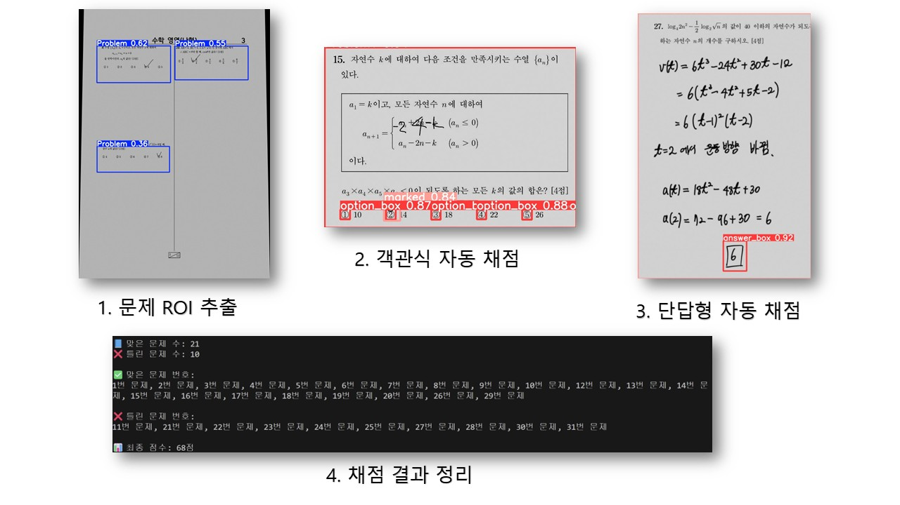

## 2. 실행을 위한 설치 패키지
git에서 yolov5을 다운을 받은 후 다음과 같은 directory를 만들면 실행이 가능하다.
<pre>
#git에서 프로젝트 설치 
git clone https://github.com/yeonshiri/AGS.git
cd AGS
pip install -r requirements.txt

#paddleOCR 추가 설치 
python3.9 -m pip install "paddlepaddle==2.5.2" -f https://www.paddlepaddle.org.cn/whl/linux/arm/openblas.html

#yolov5 설치 
git clone https://github.com/ultralytics/yolov5.git
cd yolov5  
pip install -r requirements.txt 
</pre>   

linux가 아닌 windows에서 실행시 yolov5/models/experimental.py 에서 다음과 같이 문구 수정이 필요.
<pre>
#코드 추가
import pathlib
pathlib.PosixPath = pathlib.WindowsPath

#코드 수정 (encoding = 'latin1' 추가)
ckpt = torch.load(attempt_download(w), map_location="cpu", encoding = 'latin1') 
</pre>  

경로 구조는 다음과 같다.
<pre>
├── AGS
│   ├── main.py
│   ├── yolov5
│   ├── codes
│   │   ├──roi.py
│   │   ├──detector.py
│   │   ├──grading
│   │   │   ├──objective.py
│   │   │   └──subjective.py
│   ├──data
│   │   ├── weights
│   │   │   ├── mc.pt
│   │   │   ├── sa.pt
│   │   │   └── roi.pt
│   │   ├── answer
│   │   │   └── answer_key.json
</pre> 

### 환경
- Python 3.9.21
- PaddleOCR 2.6.1.3
- YOLOv5 v7.0
  
## 3. 데이터 준비

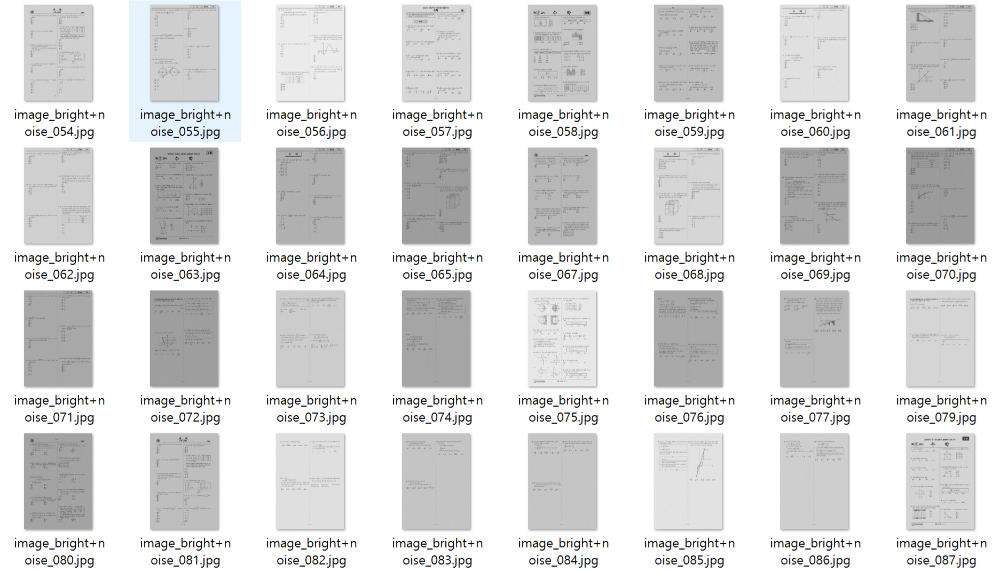

다양한 데이터 환경을 위해 모의고사, 수능, 공무원, 검정고시, 경찰지 시험지를 수집했다. 학습 알고리즘 개발을 목적으로 실제 시험지 사진이 아닌 pdf로 진행 중이다. 다만 실제 시험지 환경과 유사한 효과를 내기 위해 밝기 변경, 노이즈 추가, y축 비틀기와 같은 데이터 증강을 적용하였습니다. 객관식 문항은 다양한 형태의 마킹 형태를 추가하였으며, 단답형 문항은 풀이 과정과 답안 영역을 삽입하여 dataset으로 구성하였다. 

### 모델 학습
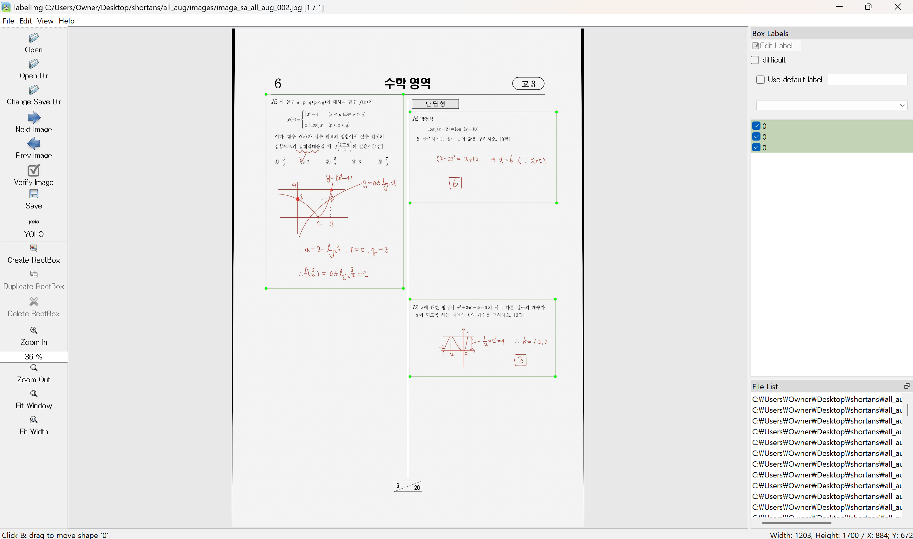
labelImg 툴을 사용하여 모든 이미지에 수작업으로 라벨링을 진행하였다. 시험지 full shot에서는 문제 구역을 객관식과 단답형을 다른 class로 하여 라벨링을 진행, 객관식과 단답형 채점 과정의 경우 이미 잘려진 ROI에서 답안 box를 라벨링하는 과정을 거쳤다.

## 4. ROI 추출
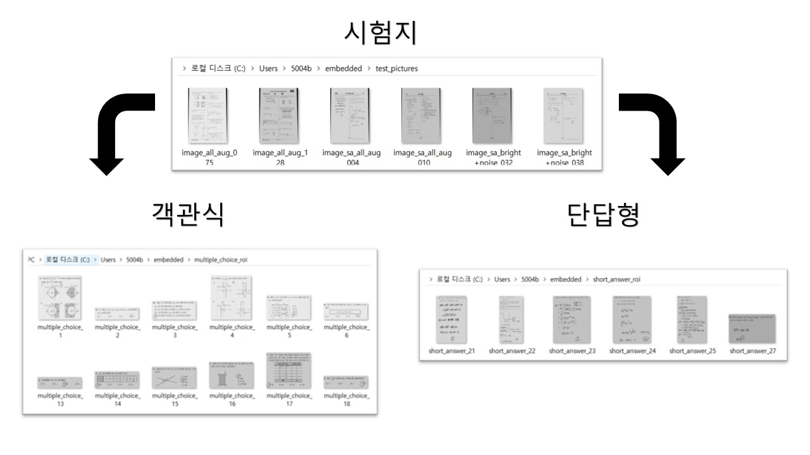

위와 같이 객관식과 단답형 문제를 서로 다른 class로 학습을 진행한 후 각각 다른 경로에 저장되도록 설계하였다.

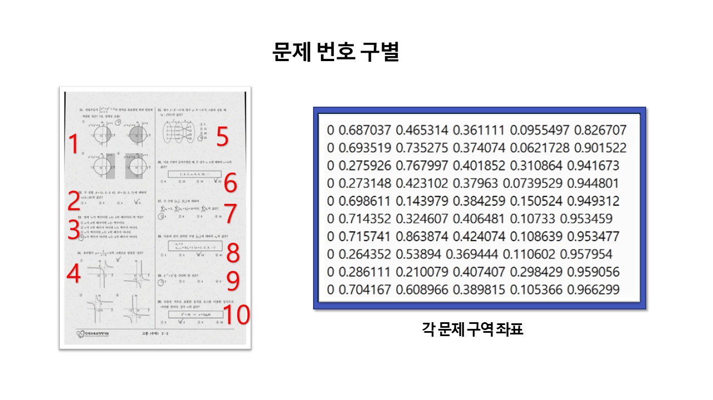
일반적인 시험지는 왼쪽 위에서부터 아래로 번호가 증가한 후 오른쪽으로 넘어가는 형식을 채택하기 때문에, 해당 특성을 이용하여 좌푯값을 기반으로 문제 번호를 정렬하는 알고리즘을 제작했다. 문제 구역 bounding box의 중심 좌푯값을 이용하여 ROI를 x좌표 오름차순 --> y좌표 오름차순으로 정렬하면 해당 ROI의 문제 번호를 매칭시킬 수 있다.

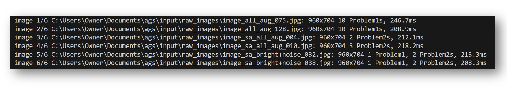
[시험지에서 ROI가 추출되는 과정]

## 5. 객관식 자동 채점
### 1. 선택지와 답안 detect
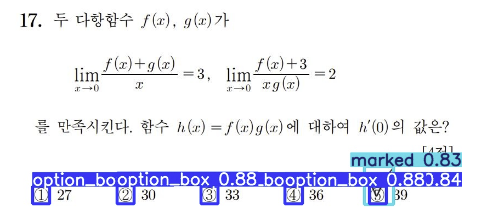
yolov5m을 이용하여 option_box(선택지)와 marked_box(선택 답안) 2개의 class로 구분하며 객관식 선택지와 선택된 답안을 학습시켰다.
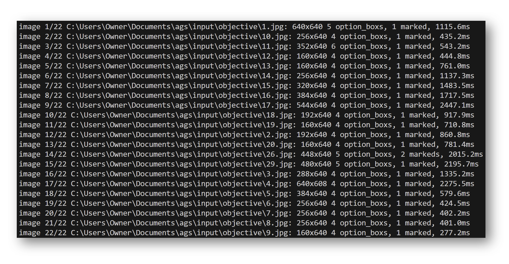
[객관식 ROI에서 선택지와 답안이 detect되는 과정]

### 2. 답안과 선택지 번호 매칭 알고리즘
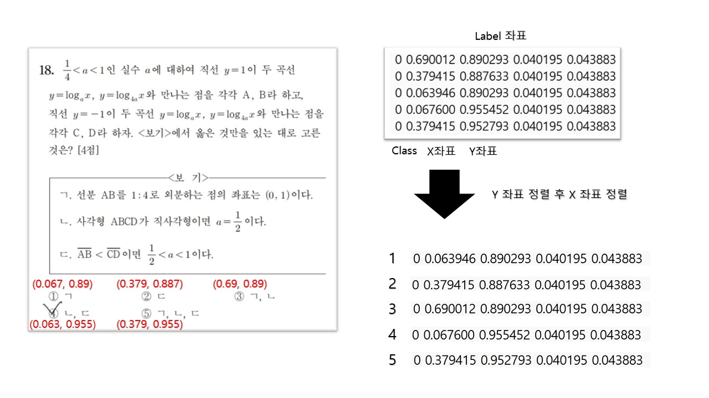
bbox detect 후, label.txt로 얻어진 좌푯값을 추출하여 각 bbox의 x좌표와 y좌표를 얻어낸다. 먼저 y좌표로 오름차순 정렬을 하고 x좌표로 오름차순 정렬을 하면 각 선택지 bbox를 번호 순서대로 나열 가능하다. 그 후 선택 답안의 좌푯값과 가장 거리가 가까운 선택지 좌푯값을 찾아내어 매칭시키면 해당 문제의 답을 알아낼 수 있다. 이렇게 얻어진 답을 dictionary에 저장한다.

## 6. 단답형 자동 채점
### 1. 답안 box 위치 detect 후 추출
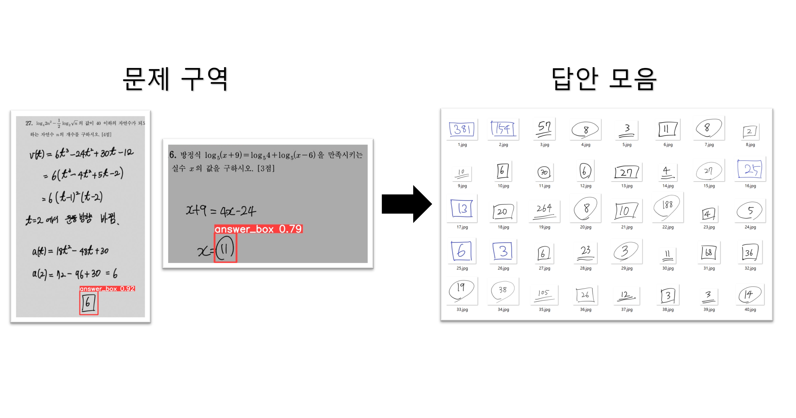
yolov5n을 이용하여 답안 answer_box를 학습시키고 시험지에서 detect한 후, 얻어낸 label의 좌푯값을 활용하여 answer box만 ROI로 저장한다.
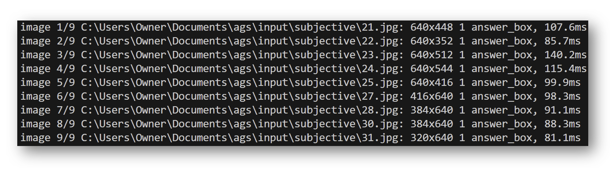
[단답형 ROI에서 answer box가 detect되는 과정]

### 2. OCR을 이용한 답안 인식
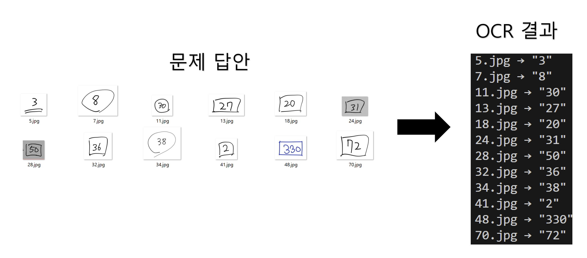
Paddle OCR lite를 이용하여 answer box 내부 답안을 인식하는 과정을 거치고 dictionary에 저장한다.
(내부 알고리즘 수정 중입니다.)

## 7. 답안과 정답 비교 후 점수 표시
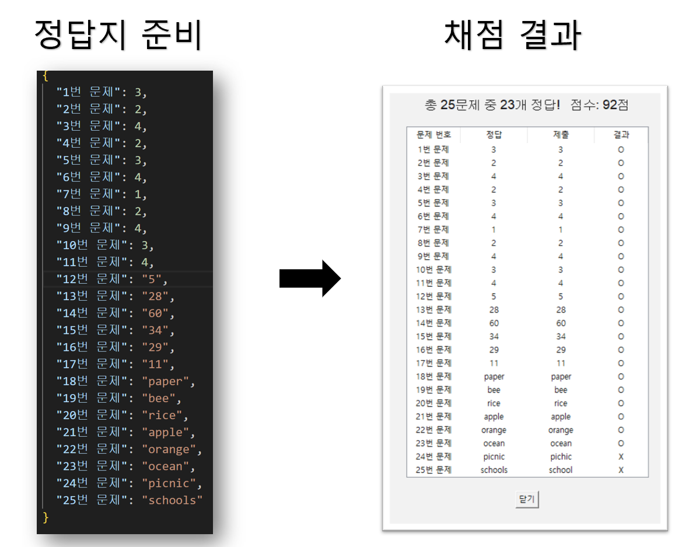
사전에 json 파일로 입력된 정답지와 답안 dictionary를 비교하여 먼저 선택 답들을 보여준 후 맞은 문제, 틀린 문제, 최종 점수를 표시한다.
