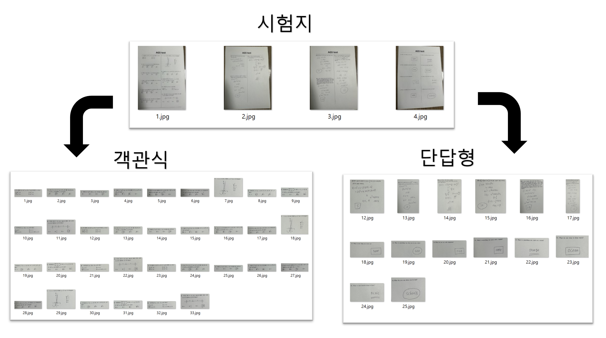
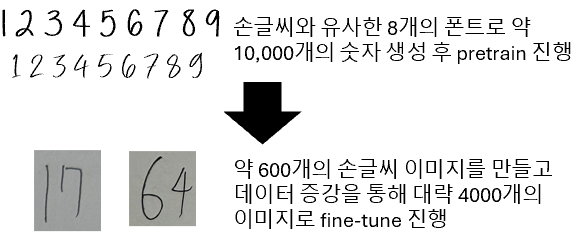
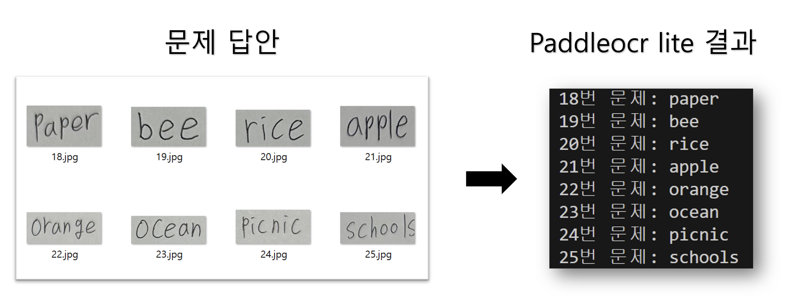

# Auto Grading System

## 프로젝트 설명
객관식과 단답형으로 이루어진 시험지를 이미지 데이터로 변환 후, 각 문제 구역을 객관식과 단답형으로 구분하여 각각 다른 경로에 ROI로 추출한다. 이후 각 문제에 기입된 답안을 정답과 비교하며 자동으로 채점이 이루어지는 시스템이다. 라즈베리파이 환경에서 구현한다.

## 목차
1. 프로젝트 전체 흐름
2. 실행을 위한 설치 패키지
3. 데이터 준비
4. ROI 추출
5. 객관식 자동 채점
6. 단답형 자동 채점
7. 답안과 정답 비교 후 점수 표시

## 1. 프로젝트 전체 흐름
프로젝트의 전체 흐름은 다음과 같다.

1. 시험지에서 객관식과 단답형 ROI 구분 추출
2. 객관식 자동 채점
    1. 선택지(option_box)와 답안(marked) detect
    2. 번호 매칭 알고리즘을 통해 답안의 선택지 번호 추정
    3. 각 답안을 딕셔너리에 저장
3. 단답형 자동 채점
    1. 답안 box(box)와 답안(answer) detect
    2. 숫자와 영어로 답안 ROI 구분 추출
        1. 숫자: custom CRNN 구조 + CTC 알고리즘을 이용하여 답안 인식
        2. 영어: Paddle OCR lite를 이용하여 답안 인식
    3. 각 답안을 딕셔너리 저장
4.  딕셔너리 채점 후 결과 정리

## 2. 실행을 위한 설치 패키지
git에서 yolov5를 다운로드 받은 후 다음과 같은 directory를 만들면 실행이 가능하다.
<pre>
#git에서 프로젝트 설치 
git clone https://github.com/yeonshiri/AGS.git
cd AGS
pip install -r requirements.txt

#paddleOCR 추가 설치 
python3.9 -m pip install "paddlepaddle==2.5.2" -f https://www.paddlepaddle.org.cn/whl/linux/arm/openblas.html

#yolov5 설치 
git clone https://github.com/ultralytics/yolov5.git
cd yolov5  
pip install -r requirements.txt 
</pre>   

linux가 아닌 windows에서 실행시 yolov5/models/experimental.py 에서 다음과 같이 문구 수정이 필요.
<pre>
#코드 추가
import pathlib
pathlib.PosixPath = pathlib.WindowsPath

#코드 수정 (encoding = 'latin1' 추가)
ckpt = torch.load(attempt_download(w), map_location="cpu", encoding = 'latin1') 
</pre>  

경로 구조는 다음과 같다.
<pre>
├── AGS
│   ├── main.py
│   ├── yolov5
│   ├── codes
│   │   ├──roi.py
│   │   ├──detector.py
│   │   ├──grading
│   │   │   ├──objective.py
│   │   │   └──subjective.py
│   ├──data
│   │   ├── weights
│   │   │   ├── mc.pt
│   │   │   ├── sa.pt
│   │   │   └── roi.pt
│   │   ├── answer
│   │   │   └── answer_key.json
</pre> 

### 환경
- Python 3.9.21
- PaddleOCR 2.6.1.3
- YOLOv5 v7.0
  
## 3. 데이터 준비

다양한 데이터 환경을 위해 모의고사, 수능, 공무원, 검정고시, 경찰대 시험지를 수집했고 영어 단답형의 경우 직접 custom 시험지를 제작하였다. PDF 이미지와 실제 시험지 이미지를 함께 사용했으며, PDF 이미지의 경우 실제 시험지 환경과 유사한 효과를 내기 위해 밝기 변경, 노이즈 추가, y축 비틀기같은 Augmentation을 적용했다. 객관식 문항은 다양한 형태의 마킹 형태를 삽입하였으며, 단답형 문항은 풀이 과정과 답안 box를 삽입했다.

### 모델 학습

labelImg 툴을 사용하여 모든 이미지에 직접 라벨링을 진행하였다.
- 시험지 full shot: 객관식과 단답형 문제 구역을 다른 class로 구분하여 라벨링
- 객관식: 선택지(option_box)와 답안(marked)을 라벨링
- 단답형: 답안 box(box)와 답안(answer)을 라벨링

## 4. ROI 추출

시험지 full shot에서 학습된 yolov5n 모델을 이용하면 객관식 문항과 단답형 문항이 구분되어 다른 경로로 저장된다.

일반적인 시험지는 왼쪽 위에서부터 아래로 번호가 증가한 후, 오른쪽으로 넘어가는 형식을 채택한다. 해당 방식을 착안하여 다음과 같은 알고리즘을 제작했다.
- 번호 매칭 알고리즘: 시험지 full shot에서 각 bbox의 중심 좌표를 이용한다. label.txt로 얻어진 좌푯값을 추출하여 각 bbox의 x, y좌표를 얻어낸 후, 각 bbox의 x좌표를 오름차순 → y좌표를 오름차순으로 정렬하여 번호를 부여하면 모든 ROI에 문제 번호를 매칭시킬 수 있다. 시험지가 여러 장이어도 적용 가능하다.

[시험지에서 ROI가 추출되는 과정]

## 5. 객관식 자동 채점
### 5-1. 선택지와 답안 detect

학습된 yolov5n 모델을 이용하여 객관식 ROI에서 선택지(option_box)와 답안(marked)을 detect한다.

[객관식 ROI에서 선택지와 답안이 detect되는 과정]

### 5-2. 답안의 선택지 번호 추정

앞서 문제 번호 정렬에 사용된 것과 동일한 알고리즘이 사용된다. 각 bbox의 y좌표를 오름차순 → x좌표를 오름차순으로 정렬하여 선택지에 번호를 부여한 후 답안의 좌푯값과 가장 거리가 가까운 선택지 좌푯값을 찾아내어 매칭시키면 해당 문제의 답을 알아낼 수 있다. 이렇게 얻어진 각 답안을 dictionary에 저장한다.

## 6. 단답형 자동 채점
### 6-1. 답안 box와 답안 detect

학습된 yolov5n 모델을 이용하여 답안 box(box)와 답안(answer)을 단답형 ROI에서 detect한 후, label 좌푯값을 이용하여 답안(answer)만 별도의 ROI로 저장한다.

[단답형 ROI에서 answer box가 detect되는 과정]

### 6-1-1. 숫자 답안 인식

custom 학습된 CRNN 구조에 CTC 알고리즘을 이용하여 숫자 답안을 인식하고 dictionary에 저장한다.

CRNN+CTC의 기본 정의는 다음과 같다
- CNN: 입력 이미지에서 공간적 특징을 추출한다.
- RNN: 정보를 시퀀스(순서) 처리하여 글자 간 연결 정보를   
  반영한다. 
- Linear: 각 시점의 특징을 숫자 클래스별 확률로 변환한다
- CTC:  위치 정보 없이 정답 시퀀스(순서)를 학습할 수 있게      
  해주는 손실 함수다. 중복 문자와 공백을 제거 후 문자열을   
  예측한다.
  

### 6-1-2. 영어 답안 인식

Paddle OCR lite 모델을 이용하여 영어 답안을 인식하고 dictionary에 저장한다.

## 7. 답안과 정답 비교 후 점수 표시

사전에 json 파일로 입력된 정답지와 앞에서 작성된 답안 dictionary를 비교하여 답안 → 맞은 문제와 틀린 문제 개수 → 맞은 문제 번호 → 틀린 문제 번호 → 최종 점수 순서로 화면에 표시한다.
